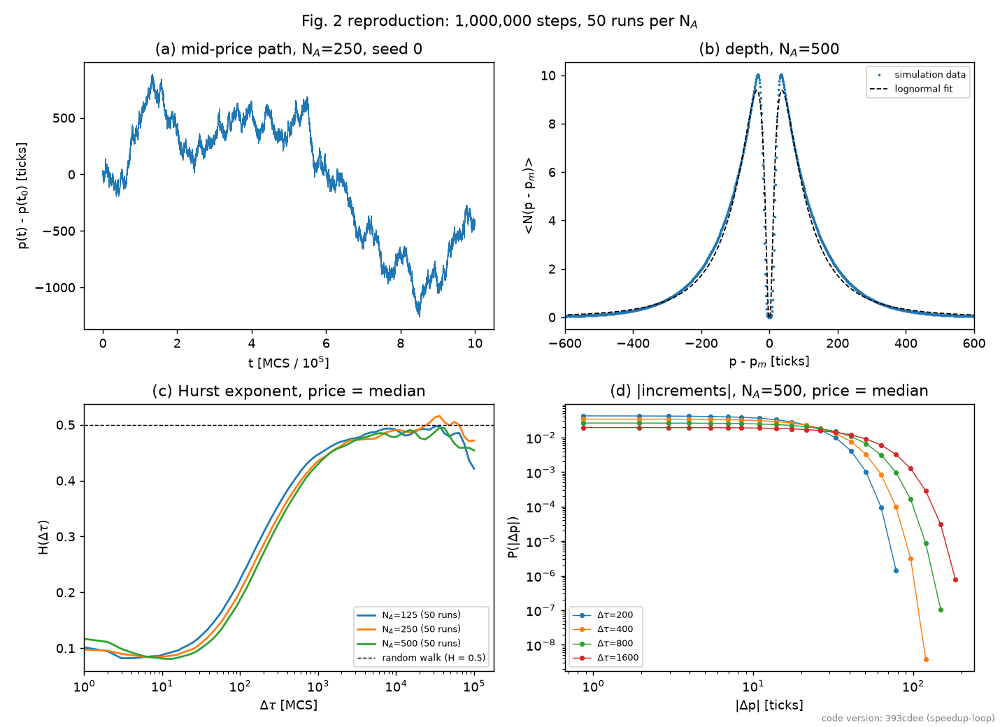
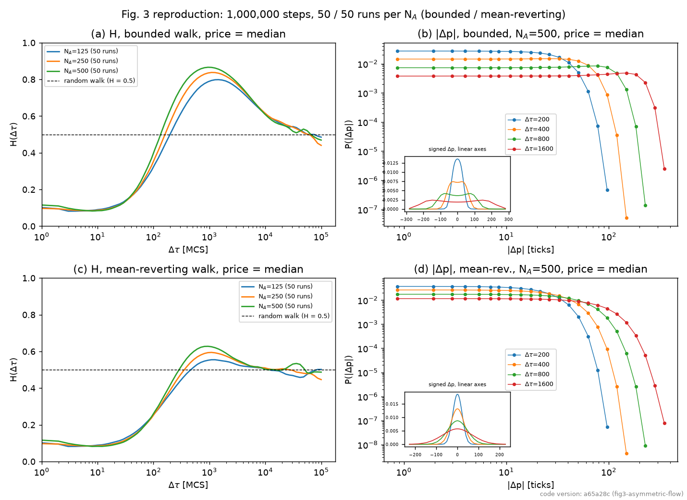
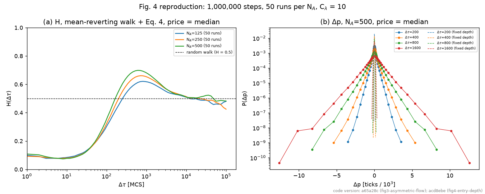

# HFT / Order-Book Agent-Based Model

An agent-based model of a limit order book, built on Preis, Golke, Paul & Schneider (2006),
"Multi-agent-based Order Book Model of financial markets", *EPL* 75, 510. The paper is first
reproduced as a validated baseline. The baseline is then used to study flash crashes: when a large
sell order turns into a crash, and what stops it.

## Status

- **Phase 1 (done):** Figs. 2, 3 and 4 of the paper reproduced at paper scale (10⁶ steps, 50 runs
  per N_A). See [Results](#results). This version is tagged `baseline-v1`.
- **Phase 2 (next):** add a large sell algorithm and a few intermediaries with inventory limits,
  following Kirilenko et al. (2017) on the May 2010 Flash Crash. Then compare fast (HFT-like) and
  slow (market-maker-like) intermediaries, and test interventions such as a trading pause.
  See [docs/phase2_plan.md](docs/phase2_plan.md).

Status and next steps are in [docs/project_plan.md](docs/project_plan.md). The reasoning behind
each modelling and measurement choice is in [docs/decisions.md](docs/decisions.md).

## Results

The paper does not say which price it uses. The median trade price in each step is used here,
because it matches the paper's Fig. 2c best ([decisions.md](docs/decisions.md), D11).

**Fig. 2: basic model.** At long time lags the price moves like a random walk (Hurst exponent
H → 0.5). At short lags it is anti-persistent, with H down to about 0.08 near Δτ ≈ 10. The order
book depth has a lognormal-like shape, and price changes have no fat tails. All as in the paper.



**Fig. 3: trends in order flow.** The takers' buy probability follows a random walk. This pushes H
above 0.5 near Δτ ≈ 10³: up to 0.87 for the bounded walk (paper: up to 0.9) and 0.63 for the
mean-reverting walk. The bounded walk gives two-peaked price-change distributions, as in the paper.



**Fig. 4: fat tails.** Linking order placement depth to the trend (the paper's Eq. 4) gives fat,
exponential tails (straight lines on the semi-log plot). Without it they are close to Gaussian (dashed
lines). The tail widths match the paper's Fig. 4b to within reading error: for example, at
Δτ = 200 the curve reaches 10⁻⁷ at about 2,200 ticks (paper: 2,000–2,500).



## Layout

| Folder | Contents |
|---|---|
| `abm/` | The model: `orderbook.py` (matching engine), `agents.py` (liquidity providers / takers, and the asymmetric order-flow processes), `simulation.py` (step loop, runs agents through orderbook) |
| `analysis/` | Measurements on one simulation's output: `prices.py` (price series), `hurst.py` (Hurst exponent), `returns.py` (return distributions), `depth_profile.py` (depth profile + lognormal fit) |
| `experiments/` | Reproducing the paper's figures: `run.py` (runs many simulations and saves the results), `plot.py` (draws Fig. 2, 3 or 4 from saved results); `checkpoint.py` and `provenance.py` are support code these two use, not called directly |
| `tests/` | One test file per file above |
| `docs/` | `project_plan.md` (status and next steps), `decisions.md` (assumptions and choices to note in the thesis), `phase2_plan.md` (draft plan for the flash-crash work), `figures/` (the final plots shown above) |
| `results/` | Generated data and plots (not tracked by git) |

## Pipeline of results

```
abm/simulation.py        runs ONE simulation -> a SimulationResult
        |
        v
analysis/*.py             turns a SimulationResult into numbers
  prices.py                  price series (mid, or a trade price)
  hurst.py                   Hurst exponent, from RMS price changes
  returns.py                 return-distribution histograms
  depth_profile.py           depth profile + its lognormal fit
        |
        v
experiments/run.py        runs MANY simulations (parallel, resumable),
                           calls analysis/*.py on each, saves results/*.pkl
        |
        v
experiments/plot.py       reads saved .pkl files, draws a figure
```

Suggested reading order for the code: `abm/orderbook.py` first (what one order book does), then
`abm/agents.py` and `abm/simulation.py` (what runs on top of it), then whichever
`analysis/*.py` file matches the quantity of interest. `experiments/` only
orchestrates those pieces at scale — there is no separate model logic there.

## Running things

Run every command from the project root, using `python -m` so the imports resolve.

All tests at once (about a minute):

```
python -m pytest tests -q
```

Or one test file at a time, printing PASS/FAIL per check, e.g. `python -m tests.test_orderbook`.

A single simulation with the paper's Fig. 2 parameters (short run):

```
python -m abm.simulation
```

### Reproducing the figures

`experiments.run` runs one experiment: 50 independent runs for each of N_A = 125, 250, 500, spread
over CPU cores. `--flow` chooses how the takers' buy probability behaves: `symmetric` (constant ½,
Fig. 2; the default), `bounded` or `mean-reverting` (the two random walks of Fig. 3).
`--depth-coupling 10` adds the volatility-coupled entry depth of Eq. 4 (Fig. 4; mean-reverting flow
only). Each setting is a separate experiment with its own results file. The paper-scale default (10⁶ steps, 50 runs per N_A)
takes about 5–6 hours per flow on a 4-core laptop, so a small trial first is advisable:

```
python -m experiments.run --n-steps 100000 --n-runs 4 --out results/fig2_trial.pkl
python -m experiments.plot fig2 --data results/fig2_trial.pkl --out results/fig2_trial.png
```

Fig. 3 needs both random-walk experiments:

```
python -m experiments.run --flow bounded --out results/fig3_bounded.pkl
python -m experiments.run --flow mean-reverting --out results/fig3_mean_reverting.pkl
python -m experiments.plot fig3 --bounded results/fig3_bounded.pkl --mean-reverting results/fig3_mean_reverting.pkl --out results/fig3.png
```

Fig. 4 needs one more experiment; `--compare` adds the Fig. 3 mean-reverting results (fixed entry
depth) to the distribution panel as dashed lines:

```
python -m experiments.run --flow mean-reverting --depth-coupling 10 --out results/fig4.pkl
python -m experiments.plot fig4 --data results/fig4.pkl --compare results/fig3_mean_reverting.pkl --out results/fig4.png
```

The paper does not say which "price" it uses, so each run stores results for five definitions
(`mid`, `last`, `first`, `median`, `mean`). The plots use the median trade price by default
(`docs/decisions.md`, D11); `--price mid` etc. selects another. `plot fig2` also saves a second
figure (`..._price_definitions.png`) comparing all five.

Each run is saved as soon as it finishes (in `<name>.pkl.parts/`), so an interruption
(sleep, crash, power cut) loses at most the runs in progress. To continue, repeat the same
command with `--resume`; already-saved runs are skipped. `--resume` also extends a finished
experiment: run 10 seeds now, then rerun with `--n-runs 50 --resume` to add the other 40. It
refuses if the settings, the flow, the entry depth or the code version differ from the saved runs
(`--allow-code-change` overrides the code check when the change is known not to affect the
simulation). If a run fails or the experiment is stopped with Ctrl+C, the runs still queued are
cancelled at once rather than run to completion.

## Requirements

Python 3.12+ (the fast simulation method uses `random.binomialvariate`) with `numpy`, `matplotlib`
and `pytest`.

Note for PowerShell: do not pipe the runner's output through `Select-Object -First N`. That closes
the output after N lines, which stops the runner at its next progress message.
